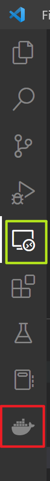

# VS Code - Docker for a nice Swift edition on Windows10

**As a student who is also confused about using Swift on Windows10, I can understand how hard you are if you cannot afford a Macbook** :joy:. **Let's get started and prove that we can do the same thing as a Windows pioneer!**

**There are several steps here for you to reach a slightly friendly interface:**

1.  Software preparation.
    
2.  Set up Swift image on your local machine.
    
3.  Use Docker Container in your VS Code.
    
4.  Edit Swift code and do testing. \[Not enough syntax highlighting and no autocomplete\]
    
5.  An updated way to do Swift code editing and testing. \[syntax highlighting and autocomplete\]
    
```note
Please feel free to extend the content of the page. Window10 students need your contributions! 🧠
```

**1\. Software Preparation**
----------------------------

By default, make sure your system has already been installed:

(1) Git Bash ([https://git-scm.com/downloads](https://git-scm.com/downloads)); This requirement is optional. Since this course requires you to use the `git` command, Git Bash is the incident software for installing git on windows. You can also use your cmd or PowerShell.

(2) VScode ([https://code.visualstudio.com/Download](https://code.visualstudio.com/Download)).

Then download and install:

(3) Swift ([https://www.swift.org/download/](https://www.swift.org/download/)`Windows10 x86_ 64`). This step will help you automatically set up a `swift` command in your terminal.

(4) Docker desktop ([https://docs.docker.com/desktop/install/windows-install/](https://docs.docker.com/desktop/install/windows-install/)).

**2\. Set up Swift image on your local machine**
------------------------------------------------

After installing Swift and Docker desktop, you create a swift image described in [Docker](https://oregonstate-innovationlab.atlassian.net/wiki/spaces/CS561/pages/3932272/Docker).
```tip
### Try it now :point_down:

In your hw folder, run the following:

`cd MyLibrary/`  
`swift package init -- type library`  
`cd ..`  
`docker-compose run --rm dev`
```
You probably will see the picture shown below:


At this moment, you are running an image in Docker.

Let’s check your Docker desktop and click the item that is running:


### Try it now (Optional) :point_down:

Let’s decorate the bad terminal interface! Here we will use “oh-my-zsh“.

Follow the steps:

`apt update`  
`apt install zsh`  
`apt install curl`  
`apt install vim`  
`sh -c "$(curl -fsSL https://raw.githubusercontent.com/ohmyzsh/ohmyzsh/master/tools/install.sh)"`

Then go to edit the format plug-in in the `.zshrc` file:

`cd ~`  
`vim .zshrc`

Then change `ZSH_THEME="agnoster"`.

Restart your terminal in Docker and run `zsh`

A better way is do as shown in [A good model of Docker Image](https://oregonstate-innovationlab.atlassian.net/wiki/spaces/CS561/pages/74350864/A+good+model+of+Docker+Image) , so you do not have to set the environment everytime!

After the decoration, you will see the terminal as shown below:


This beautiful terminal highlight will also be seen in the VS Code terminal later. :thumbsup:

**3\. Use Docker Container in your VS Code**
--------------------------------------------

To make VS Code your swift code editor, install the extensions: `swift`, `Docker`, and `dev containers`.


### Try it now :point_down:

1.  Now you run your docker desktop;
    
2.  Go back to VS Code and click the docker logo on the left sidebar:
    
    
3.  Make sure your local terminal is running `docker-compose run --rm dev`. Run the image in the VS Code terminal and also open the swift image in your terminal by:  
    (a) `ctrl` + `shift` + `p`  
    (b) in the command window at the top, enter: `Docker Containers: Attach Shell`
    
    
    
    (c) `zsh`:
    
    

You see! The terminal shows the same beautiful highlighting as we saw in the docker desktop terminal. :thumbsup:

**4\. Edit Swift code and do testing**
--------------------------------------

Finally, let’s see how I use the VS Code to edit Swift codes.

Firstly, `git fork` the code from the repo ([https://github.com/oregon-state-innovation-lab/cs561-swift](https://github.com/oregon-state-innovation-lab/cs561-swift) ).


Then `git clone` the forked folder into your code folder in the terminal:


Checkout to `async-await` branch:


Open swift files by clicking the content on the left side directory:


### Try it now :point_down:

Let’s do the testing of the test folder:


Check the **code coverage** `llvm-cov report ...`:


**5\. An updated way to do Swift code editing and testing**
-----------------------------------------------------------

I think you have found that using the extension in the Docker logo can not help us realize the full function of syntax highlighting and there is no autocomplete. Here I provide a way to furtherly realize the function of editing Swift code on VS Code.



Rather than using the extension of the **whale** (squared by red), we are going to use the **remote** extension (squared by green) as shown above.

Choose the `Containers` in the remote explorer:


Right-click the `image` that is running and chooses `Attach in New Window`:


In the new window, `📂 Open Folders` in the parent directory `/` (not the `/root`), then `Enter` using your keyboard.


Now you can see your files:


We still cannot see the full highlight. Let’s open the extension window in the remote interface. Click the `Install in Container swiftlang/swift-nightly-focal (.....)` button and install it in your container:


Now you can see the variables that can show up in the extension. Also, click the `Conical flask` extension and run the Test codes:


Here is the result (with variable detection, definition tracking, autocomplete, and testing):


Nice nice!!!! There are no differences between Windows VS Code and macOS Xcode now!! Bazinga :beers:

* * *

:muscle: Now you're a pro in Windows 10 swift programming… Feel free to add more cool stuff here!

Tianle Yuan – 10/14/2022
